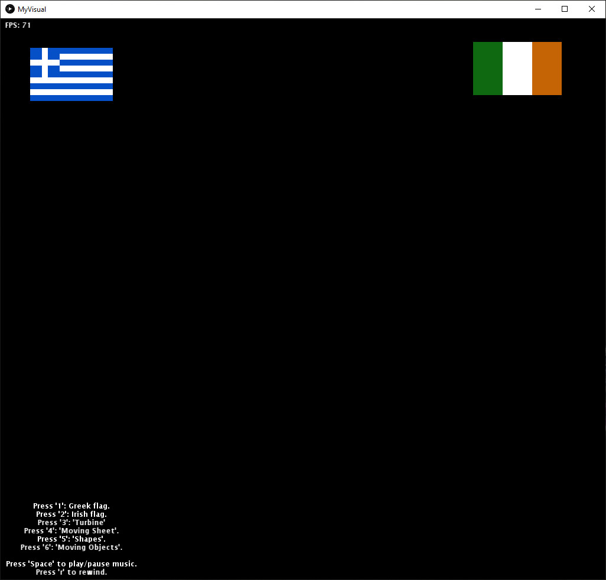
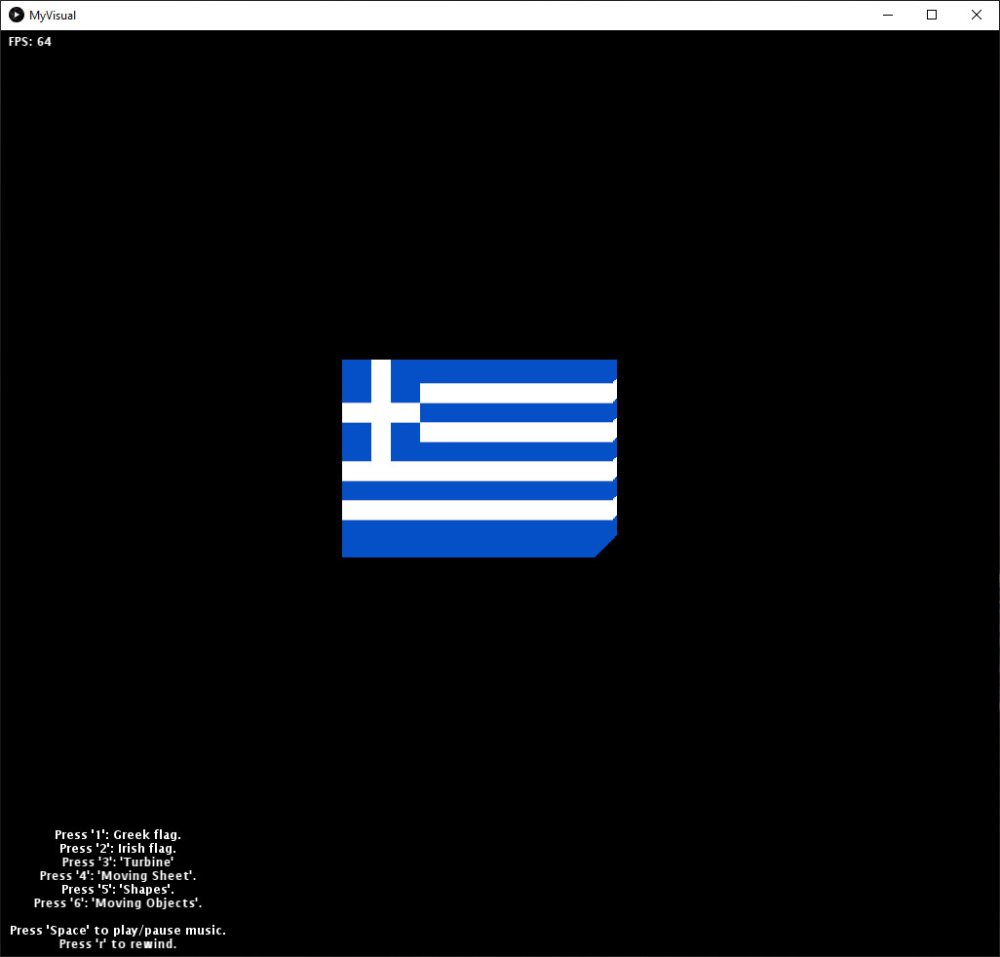
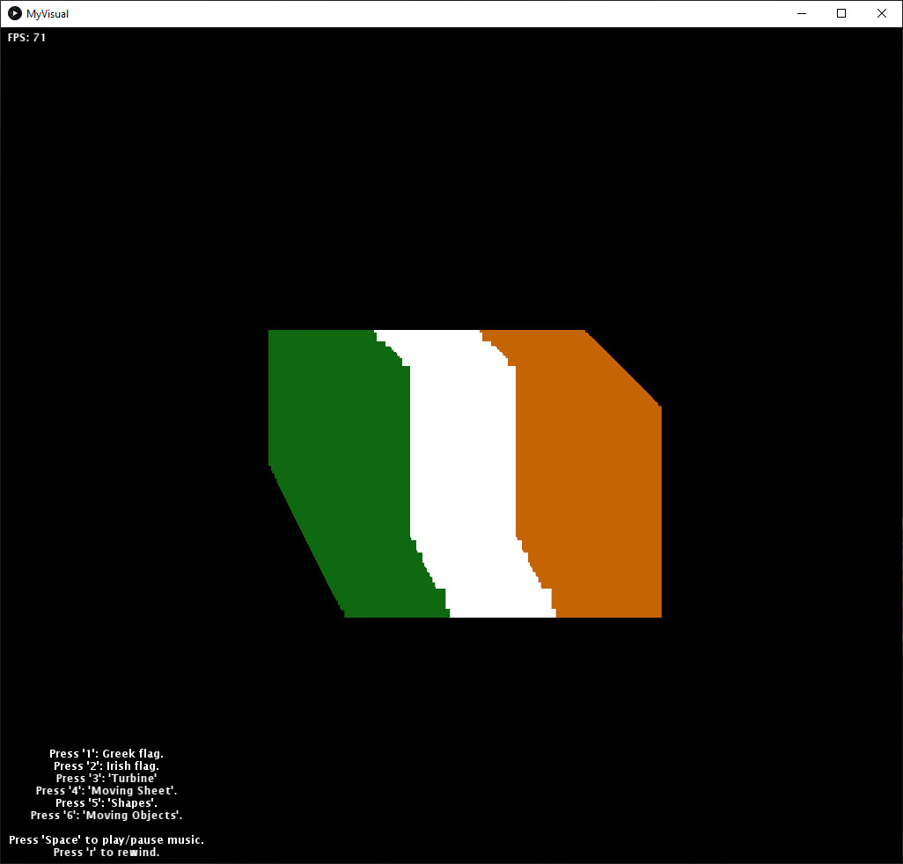
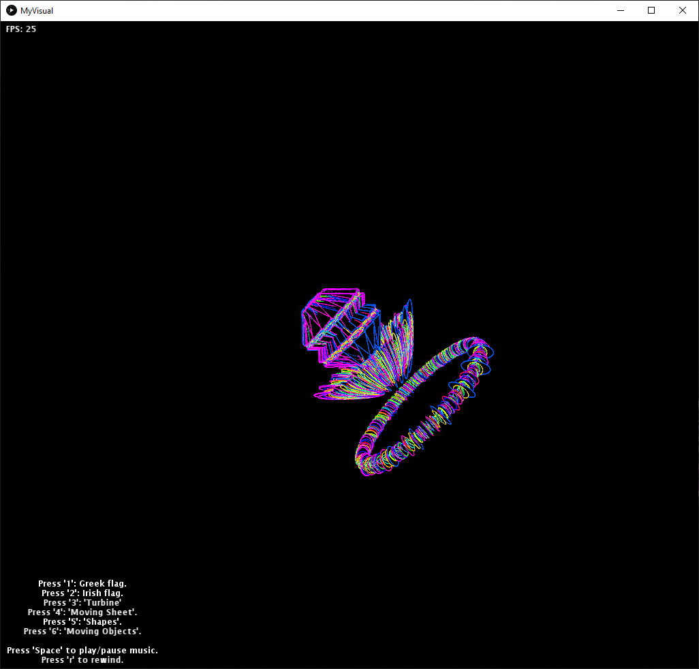
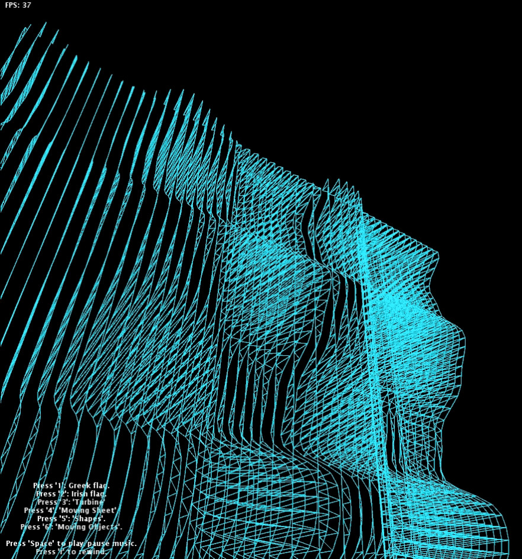
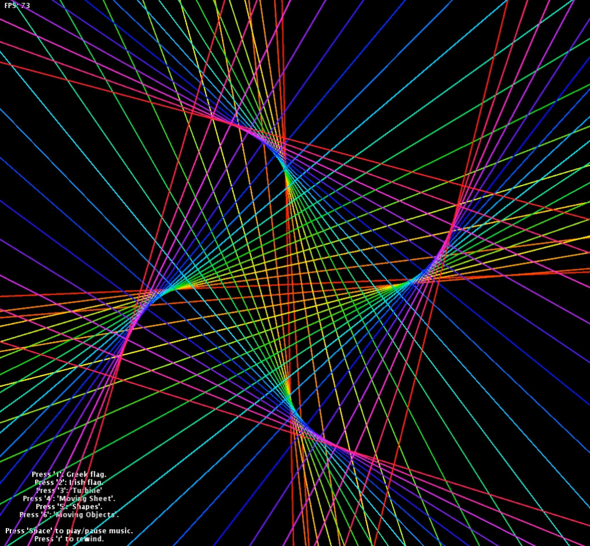
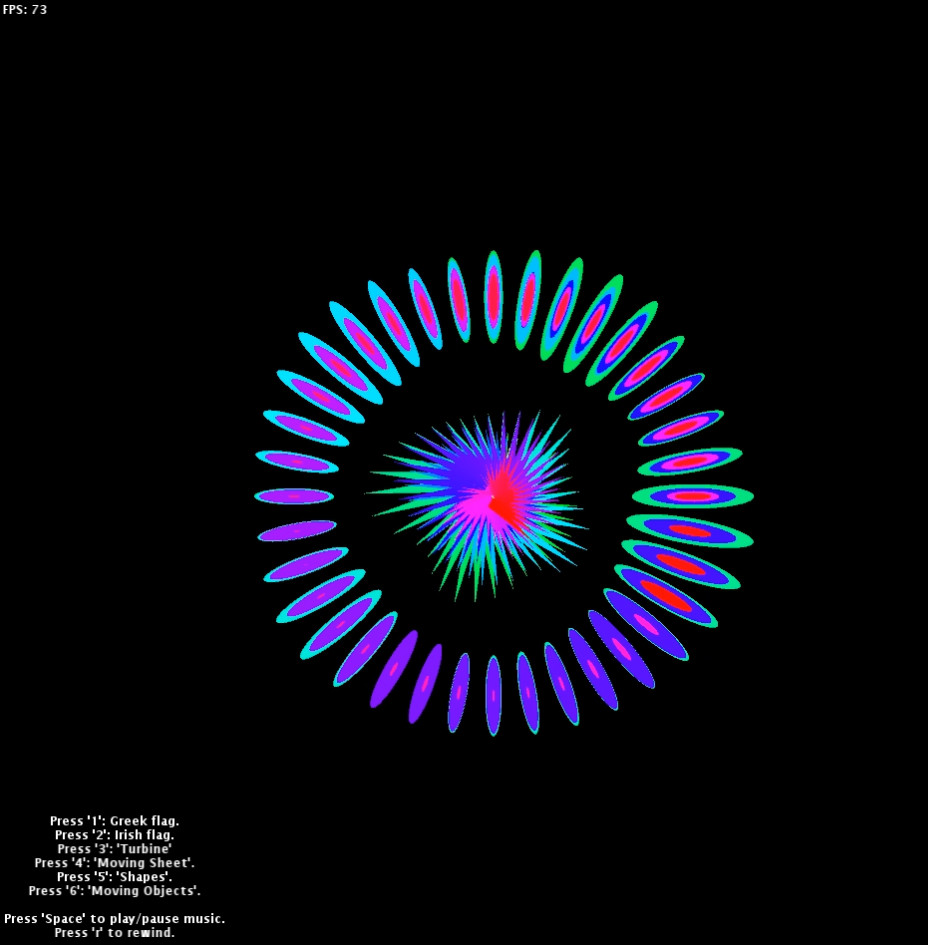

# Music Visualiser Project

Name: Panagiotis Bampilis

Student Number: C19764485

# Description of the assignment
"Music Visuals" is the title of the assignment. The main idea was to bring close two countries: Ireland and Greece with the warmth of an old greek traditional song. This project was created with 6 different visuals, letting the user to enjoy enhanced visuals and mentaly travel through those while listening to greek traditional music.

# Instructions
- By pressing the 'Space' key, the music starts playing.
- By pressing the 'r' key, rewinds the song back to the beginning. 
- The user has the option of 6 different visuals by pressing from '1' to '6'.

# How it works
This project uses PApplet from processing.core asset, it is written based on inheritance, encapsulation, constructors, getters and setters. Audio buffer, lerpedAverage and map() function were used for this project as well. Vertices were used to create a shape of a moving sheet (Visual number 4, Credits to The [Coding Train](https://www.youtube.com/user/shiffman) turotials for helping to understand how the moving sheet works) and then implemented into a visual responding to audio buffer.

## All Visuals
- This part of code below includes all seperate visual classes:
```Java
public class MyVisual extends Visual
{    
    Flags flgz;
    GreekFlagMove grkflgmv;
    IrishFlagMove irsflgmv;
    Turbine trb;
    Sheet sht;
    Shapes shp;
    MovingObjects mvobjs;
}
```
- Construstors are been used to give the chance for inheritance:
```Java
public Flags (MyVisual flgz)
{
	this.flgz = flgz;
}
```
- Setup method that includes all instances of the class, the loadAudio() function that loads the greek song (song can be changed to "greek1.mp3" or "greek2.mp3" in the code) and an optional frameRate setup for higher frequency monitors:
```Java
public void setup()
{
	// Framerate set up to 75
	// frameRate(75);

	startMinim();
	
	// Call loadAudio to load an audio file to process 
	loadAudio("greek.mp3");

	// Call this instead to read audio from the microphone
	// startListening(); 

	// All inctances from all created classes
	flgz = new Flags(this);
	grkflgmv = new GreekFlagMove(this);
	irsflgmv = new IrishFlagMove(this);
	trb = new Turbine(this);
	sht = new Sheet(this);
	shp = new Shapes(this);
	mvobjs = new MovingObjects(this);
}
```
- The default visual while the music is not playing:
(it is a static visual of the two beloved flags of Greek and Irish!)
```Java
if (getAudioPlayer().isPlaying() == false)
{
	flgz.render();
}
```
# What I am most proud of in the assignment
I am proud of creating a colorful immitation of marine turbine, which reminds me the knowledge I gained from Marine Engineering. I managed to make it rotate in two different axis (X, Y), while gives the illusion of a real exhaust gas turbine from a motor vessel.

- code for turbine:
```Java
public void render()
{
	trb.translate(width * 5, height * (float) 4.5);
	trb.colorMode(PApplet.HSB);
	trb.lights();
	trb.rotate(angle);

	for(int i = 0; i < ab.size(); i++)
	{
		trb.rotateX(50 + ab.get(i) / 100);
		trb.rotateY(50 + ab.get(i) / 50);
		// trb.noStroke();
		trb.fill(PApplet.map(ab.get(i), 0, 100, 0, 0), 100, 0);
		trb.strokeWeight(1 + ab.get(i));
		trb.stroke(PApplet.map(i, 0, ab.size(), 255, 0), 255, 255);
		trb.ellipse(200, 30, 10 + ab.get(i) * 100, 20);
		trb.ellipse(100, 10, 10, 55 + ab.get(i) * 200);
		trb.box(100 + ab.get(i) * 50, 50, 20);
		trb.box(100, 55 + ab.get(i) * 50, 10);
	}
	angle += 0.01f;
}
```

# Visual Description

The visuals are seperated below:

1. Greek Flag: A greek flag that bounces up and down on music's amplitude.
1. Irish Flag: A irish flag that bounces up and down on music's amplitude.
1. Turbine: A colorful immitation of a real marine exhaust gas turbine.
1. Sheet: A light blue moving sheet that bounces on music's amplitude.
1. Shapes: A Colorful spirals generally rotating clockwise forming various shapes.
1. Moving Objects: Colorful Ellipses forming a circle and tringles in the middle all together vibrating to music's response.

# Screenshots of each Visual
## Respectively
1. Visuals while music is not playing


1. Visual for Greek bouncing flag.


1. Visual for Irish bouncing flag.


1. Visual for Turbine.


1. Visual for moving sheet.


1. Visual for colorful rotating spirals.


1. Visual for colorful moving objects.


# Video link for visual project
## Youtube thumbnail link below
[](https://www.youtube.com/watch?v=TInT4-GmV1c)